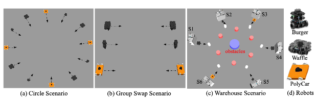

# A library for collision avoidance
We provide the collision avoidance algorithms like: NH-ORCA, RL-RVO, Heter-CA, TFresh, UTTC, QCQP etc. These algorithms can be executed in the simulation platform with different scenarios, such as circle scenarios, group swap, group crossing, and warehouse scenarios.

    

## How to launch the specific scenarios

    export PYTHONPATH=~/catkin_ws/devel/lib/python2.7/dist-packages:/opt/ros/melodic/lib/python2.7/dist-packages
    
    roslaunch scenaro/circle_6r_3t.launch  # roslaunch [launch file]
    
## How to run the training script  (RL)

    export PYTHONPATH=~/catkin_ws/devel/lib/python2.7/dist-packages:/opt/ros/melodic/lib/python2.7/dist-packages
    
    mpiexec -n 8 python2 train.py    

## How to execute the collision avoidance algorithm
    cd [algorithm folder]
    sh run_xxx.sh

